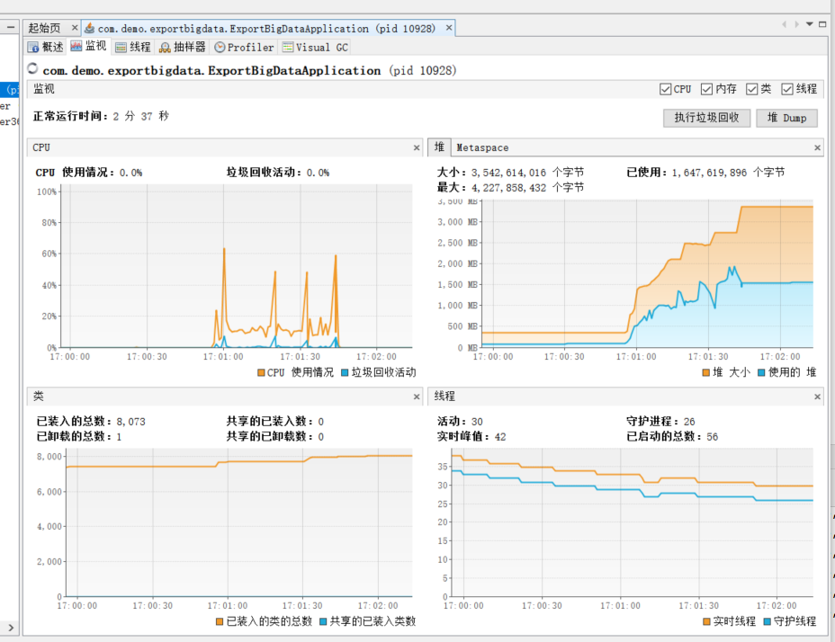
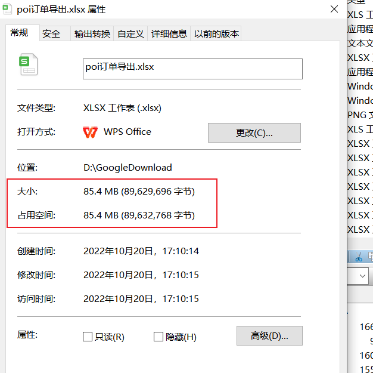
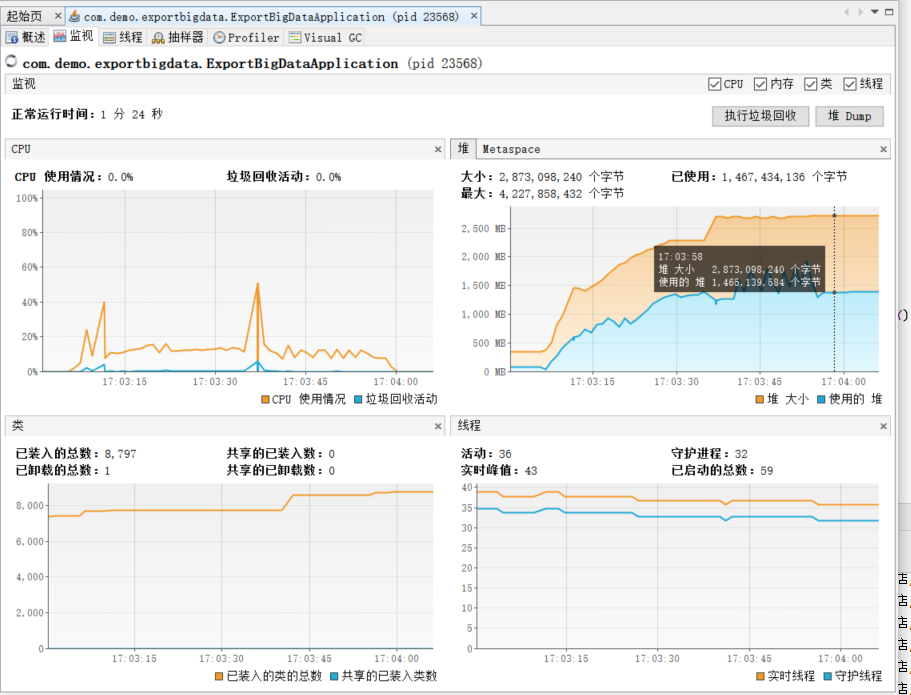
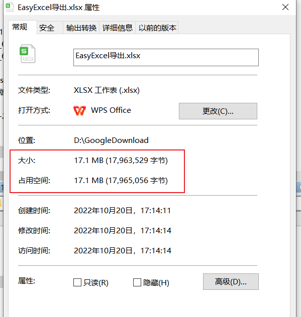

# export-big-data
本项目用于研究不同导出方案的性能情况。


## 1. 背景

​		现在企业的互联网项目中，导出数据是一个非常基本的需求，而随着业务的扩展，大数据量的导出更是常态，为了满足该需求开始比较一些导出方案：

​		① POI 导出

​		② EasyExcel 导出

​		③ Hutool 导出


## 2. 事前准备

### 2.1 引入依赖

```xml
<!-- web 支持 -->
<dependency>
    <groupId>org.springframework.boot</groupId>
    <artifactId>spring-boot-starter-web</artifactId>
</dependency>

<!-- 热部署 -->
<dependency>
    <groupId>org.springframework.boot</groupId>
    <artifactId>spring-boot-devtools</artifactId>
    <scope>runtime</scope>
    <optional>true</optional>
</dependency>

<!-- mysql支持 -->
<dependency>
    <groupId>mysql</groupId>
    <artifactId>mysql-connector-java</artifactId>
    <version>5.1.46</version>
</dependency>

<!-- lombok -->
<dependency>
    <groupId>org.projectlombok</groupId>
    <artifactId>lombok</artifactId>
    <optional>true</optional>
</dependency>

<!-- 单元测试 -->
<dependency>
    <groupId>org.springframework.boot</groupId>
    <artifactId>spring-boot-starter-test</artifactId>
    <scope>test</scope>
</dependency>

<!-- easyExcel-->
<dependency>
    <groupId>com.alibaba</groupId>
    <artifactId>easyexcel</artifactId>
    <version>2.1.7</version>
</dependency>

<!--mybatis-plus 持久层-->
<dependency>
    <groupId>com.baomidou</groupId>
    <artifactId>mybatis-plus-boot-starter</artifactId>
    <version>3.0.5</version>
</dependency>

<!-- thymeleaf 依赖 -->
<dependency>
    <groupId>org.springframework.boot</groupId>
    <artifactId>spring-boot-starter-thymeleaf</artifactId>
</dependency>

<!-- Hutool -->
<dependency>
    <groupId>cn.hutool</groupId>
    <artifactId>hutool-all</artifactId>
    <version>5.8.8</version>
</dependency>
```


### 2.2 插入40W数据

```java
    @Test
    public void testMapper() {

        CompletableFuture<Void> task1 = CompletableFuture.runAsync(() -> {
            for (int i = 0; i <= 50000; i++) {
                insert(i);
            }
            System.out.println("task1 完成");
        });

        CompletableFuture<Void> task2 = CompletableFuture.runAsync(() -> {
            for (int i = 50001; i <= 100000; i++) {
                insert(i);
            }
            System.out.println("task2 完成");
        });

        CompletableFuture<Void> task3 = CompletableFuture.runAsync(() -> {
            for (int i = 100001; i <= 150000; i++) {
                insert(i);
            }
            System.out.println("task3 完成");
        });

        CompletableFuture<Void> task4 = CompletableFuture.runAsync(() -> {
            for (int i = 150001; i <= 200000; i++) {
                insert(i);
            }
            System.out.println("task4 完成");
        });

        CompletableFuture<Void> task5 = CompletableFuture.runAsync(() -> {
            for (int i = 200001; i <= 250000; i++) {
                insert(i);
            }
            System.out.println("task4 完成");
        });

        CompletableFuture.allOf(task1, task2, task3, task4).join();
    }


    public void insert(int i) {
        CbecOrder cbecOrder =
                CbecOrder.builder()
                        .orderSn("odxxxxxx" + i)
                        .merchOrderSn("Zxxxxx" + i)
                        .merchSn("mhbsxxxxxxxxx")
                        .merchName("xxx科技")
                        .shopSn("wbxxxxxxxxxxx")
                        .shopName("xxxxxxx门店")
                        .platSn("mxxxxxx")
                        .platName("xxxxxx商城")
                        .thirdPartyMerchCode("xxxxxx")
                        .thirdPartyMerchName("xxxxxxxx")
                        .eBizType("10")
                        .eClearType("10")
                        .cusCode("06")
                        .bondedCode("xxxxxxxx")
                        .wareSn("xxxxxxxx")
                        .orderStatus("xxx")
                        .placeOrderlTime(new Date())
                        .buyerBillTime(new Date())
                        .buyerIdType("1")
                        .buyerIdCode("4xxxxxxxxxx")
                        .buyerName("xx辉")
                        .buyerMob("131xxxxxxxx")
                        .createTime(new Date())
                        .modTime(new Date())
                        .build();
        cbecOrderMapper.insert(cbecOrder);
    }
```


## 3.方案实施

### 3.1 POI导出

#### 代码实现

```java
    /**
     * 测试 poi 导出
     * @return
     */
    @GetMapping("/poi")
    public String poiExport() {
        try {
            String titles[] = {"序号", "商户订单编号", "商户号", "商户名称", "门店编号", "门店名称", "平台名称", "购买人姓名", "购买人身份证", "收货人姓名", "收货人地址"};
            return exportService.poiExport(response, titles);
        } catch (Exception e) {
            e.printStackTrace();
            return "导出失败";
        }
    }
```


```java
    /**
     * poi 导出
     * @return
     */
    public String poiExport(HttpServletResponse response, String[] titles) {
        long startTime = System.currentTimeMillis();
        // 获取导出数据
        List<CbecOrder> orderList = getData();

        // 创建 workbook
        HSSFWorkbook wb = new HSSFWorkbook();

        // 拆分 list, 每个 sheet 六万行
        List<List<CbecOrder>> splitList = ListUtil.split(orderList, 60000);

        for (int j = 0; j < splitList.size(); j++) {
            // 获取拆分的 list
            List<CbecOrder> cbecOrders = splitList.get(j);

            // 添加一个 sheet
            HSSFSheet sheet = wb.createSheet("订单数据" + j+1);
            // 添加表头
            HSSFRow row = sheet.createRow(0);
            for (int i = 0; i < titles.length; i++) {
                sheet.setColumnWidth(i, 5000);
                row.createCell(i).setCellValue(titles[i]);
            }
            // 写入实体数据
            for (int i = 0; i < cbecOrders.size(); i++) {
                row = sheet.createRow(i + 1);
                CbecOrder order = cbecOrders.get(i);
                // 创建单元格设置值
                row.createCell(0).setCellValue(order.getOrderSn());
                row.createCell(1).setCellValue(order.getMerchOrderSn());
                row.createCell(2).setCellValue(order.getMerchSn());
                row.createCell(3).setCellValue(order.getMerchName());
                row.createCell(4).setCellValue(order.getShopSn());
                row.createCell(5).setCellValue(order.getShopName());
                row.createCell(6).setCellValue(order.getPlatName());
                row.createCell(7).setCellValue(order.getBuyerName());
                row.createCell(8).setCellValue(order.getBuyerIdCode());
                row.createCell(9).setCellValue(order.getConsigneeName());
                row.createCell(10).setCellValue(order.getConsigneeAddress());
            }

        }

        try (ByteArrayOutputStream os = new ByteArrayOutputStream();){
            response.reset();
            // 设置 response 参数
            response.setContentType("application/vnd.ms-excel;charset=utf-8");
            String fileName = new String("poi订单导出.xlsx".getBytes("UTF-8"), "ISO-8859-1");
            response.setHeader("Content-Disposition", "attachment;filename=" + fileName);

            wb.write(os);
            byte[] content = os.toByteArray();
            InputStream is = new ByteArrayInputStream(content);
            // 获取响应输出流
            ServletOutputStream out = response.getOutputStream();
            // 使用缓冲流导出
            try(BufferedInputStream bis = new BufferedInputStream(is);
                BufferedOutputStream bos = new BufferedOutputStream(out);) {
                byte[] buff = new byte[2048];
                int bytesRead;
                while (-1 != (bytesRead = bis.read(buff, 0, buff.length))) {
                    bos.write(buff, 0, bytesRead);
                }
            }

        }catch (Exception e) {
            log.error("poi导出失败 => {}", e);
        }

        long endTime = System.currentTimeMillis();
        log.info("POI 导出耗时 =====》 ：" + (endTime - startTime) + "ms");
        return "导出成功";
    }
```

#### 结果展现

##### 耗时


##### CPU、内存使用情况



##### 文件大小




### 3.2 EasyExcel 导出

#### 代码实现

```java
    @GetMapping("/easyExcel")
    public String easyExcelExport() {
        try {
            exportService.easyExcel(response);
            return "导出成功";
        } catch (Exception e) {
            e.printStackTrace();
            return "导出失败";
        }
    }
```


```java
    /**
     * EasyExcel 导出
     * @return
     */
    public void easyExcel(HttpServletResponse response) throws Exception {
        long startTime = System.currentTimeMillis();
        // 获取导出数据
        List<CbecOrder> orderList = getData();
        // 拆分 list, 每个 sheet 六万行
        List<List<CbecOrder>> splitList = ListUtil.split(orderList, 60000);
        // 文件名
        String fileName = "EasyExcel导出";
        fileName = URLEncoder.encode(fileName, "UTF-8");
        // 设置 response 参数
        response.setContentType("application/vnd.ms-excel");
        response.setCharacterEncoding("utf8");
        response.setHeader("Content-disposition", "attachment;filename*=utf-8''" + fileName + ".xlsx");

        // 创建一个 EasyExcel 写
        ExcelWriter excelWriter = EasyExcel.write(response.getOutputStream(), CbecOrder.class).excelType(ExcelTypeEnum.XLSX).build();
        //   循环写 Sheet
        for (int i = 0; i < splitList.size(); i++) {
            WriteSheet writeSheet = EasyExcel.writerSheet(i, "订单数据" + (i + 1)).build();
            excelWriter.write(splitList.get(i), writeSheet);
        }
        excelWriter.finish();

        long endTime = System.currentTimeMillis();
        log.info("POI 导出 [{}] 条数据，耗时 =》 [{}] ms", orderList.size(), (endTime - startTime));

    }
```

#### 结果展现

##### 耗时


##### CPU、内存使用情况



##### 文件大小




## 4. 结论